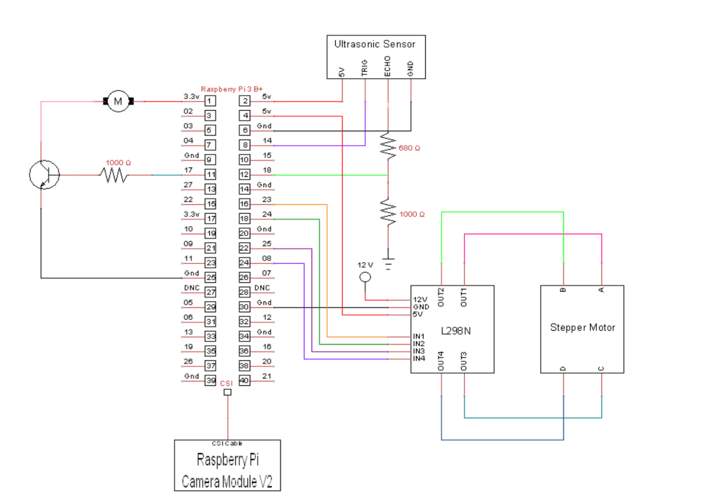

# Motion-Tracking-Fan
The ultrasonic sensor measures the distance between the fan and the person. If the distance 
is less than the threshold, the fan will be turned on. Otherwise, the fan will stay off.  
For motion detection, a camera is used to detect and track human faces. First, the camera captures raw images from the environment. Second, 
OpenCV processes the images and outputs the current position of each face. By comparing the 
current position of each face and the desired position, an error is calculated. Finally, 
the P controller determines the control effort that controls the stepper motor to track a 
person until the error reaches zero. 

Below is the program flowchart.

Below is the circuit. 

